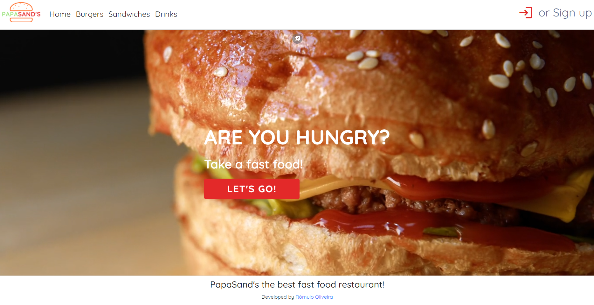

# PapaSand's Restaurant 

<br>




> This project is a full stack and totally responsive webapp, for the restaurant papasand's. In this app we can create a user and login, see the cart, choose the food that we want, put the information for the order and do the order. If we want we can cancel the order or change the address or payment form.

<br>

### 👉 You can acess here!(https://papasand-s.web.app)

https://papasand-s.web.app

### Built With

* [Vite.js](https://vitejs.dev)
* [Vue.js](https://vuejs.org/)
* [Typescript](https://www.typescriptlang.org)
* [SASS](https://sass-lang.com)
* [Firebase](firebase.google.com/)
* [Bootstrap](https://getbootstrap.com)

<br>

## 💻 Prerequisites

<br>

npm
  ```sh
  npm install npm@latest -g
  ```
<br>

## 🚀 Installing  <PapaSand's>

<br>

Clone the repo
   ```sh
   git clone https://github.com/RomuloOliveira94/papasands-restaurant-webapp.git
   ```

Install NPM packages
   ```sh
   npm install
   ```
<br>


## ☕ Using <PapaSand's>

<br>

### Compile and Hot-Reload for Development


```sh
npm run dev
```

### Type-Check, Compile and Minify for Production


```sh
npm run build
```

### Lint with [ESLint](https://eslint.org/)

```sh
npm run lint
```
<br>


## 📝 License

<br>

Distributed under the MIT License. See `LICENSE.txt` for more information.

<p align="right">(<a href="#top">back to top</a>)</p>
